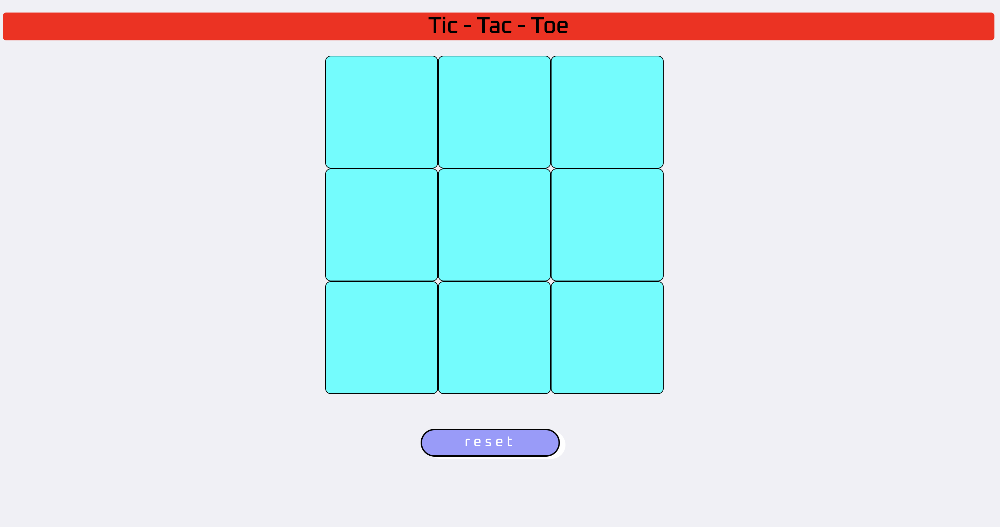

# Project Name
Tic-Tac-Toe

## Table of contents
* [LiveDemoLink](#LiveDemoLink)
* [Description](#Description)
* [Screenshots](#screenshots)
* [Technologies](#technologies)
* [Setup](#Setup)
* [CodeExamples](#CodeExamples)
* [Features](#features)
* [status](#status)
* [WishList](#WishList)
* [Contact](#contact)

## LiveDemoLink
[LiveDemoLink](https://harish6788.github.io/proZero2/)

## Description
This is a simple game of tic tac toe that I has been created with javascript/jquery. This can be played as a two player game against each other with a simple UserInterface and mild CSS effects.

## Screenshots

## Technologies
[jQuery JavaScript Library v3.4.1 ](https://jquery.com/)

## Setup
<h5>To Play the game</h5>
* git fork(to get the code from my Repository to your remote repository)
* git clone "URL"(to get the code from your repository to the Local Repository)

<h5>To Update any codes to the existing Project do the steps as follows:</h5>
* git add -A
* git commit -m "your message"
* git pull upstream master
* git push origin master
* Pull request to merge the changes made

## CodeExamples
<h5>Sample Javascript code:</h5>

const input = function(){
  if(!resultAttained){
    isClicked($(this).html());
    if ( !divClicked && divClickCount%2 === 0 ){
      $(this).text("X");
      winCheck();
    }else if ( !divClicked && divClickCount%2 !== 0 ){
      $(this).text("O");
      winCheck();
    }else if ( divClicked ){
      alert("click only empty box!")
    }
  }else{
    alert("Game Over reset!")
  }
};

## Features
List of features ready:
* Two Player Game Option
* Interactive User Interface
* Improved look and feel

To-do list:
* Add a scoreboard
* show player turns and option to choose marker between players

## Status
Project is: _in progress_

## WishList
* Option to play against computer(AI)
* more fascinating UI
* Level of the game say easy, medium, Hard

## Contact
Created by [@Harish](vvpdharish@gmail.com) - feel free to contact me!
